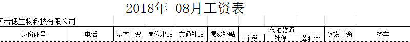
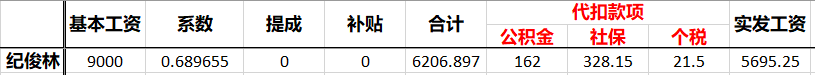

# brs 工资模块设计

---------------------
## 需求分析
### 员工工资组成：

1 + 基本工资

2 + 福利
 交通补贴 

试用期没有

南京 转正 每人 10元

滁州 转正 每人 4元

3 + 全勤奖

滁州

4 + 提成
南京 编辑
每月4个订单，超过 第5个 750元。

5 -请假（事假，病假...）
每个月员工有半天请假天数；女生有1天例假天数。

6 - 考勤扣除部分 
迟到 水果基金；早退（？）；旷工（和请假模块关联）

### 工资模块涉及对象
1. 会计
2. 员工
3. 公司

### 输出
建行，民生银行 Excel表 （字段固定）

### 关注

社保，公积金交纳

因为缴纳基数不一样。
南京 最低基数3030 缴纳社保，公积金
滁州 基数3096.95。当员工基本工资未达到缴纳基数时，任按该基数缴纳社保，公积金。

个税

2019年个税缴纳标准                                                                     

### 工资模块数据库设计

#### 社保模板
因为不同地方，缴纳社保基数，比例不同。

### 工资模板
项目
1. basic_salary  基本工资
2. payment  个人税前工资(合计)
2. workday_factor 工作天数系数（正常工作日除以法定每月工作天数21.75）
3. commission 提成
4. social_insurance 社保
5. tax_of_staff 个人所得税
6. social_insurance_of_staff 个人缴纳社保
7.  social_insurance_of_company公司缴纳社保
8. expenditure 公司支出合计
6. payment_in_hand 个人税后工资（到手）
7. travel_allowance 交通补贴
8. deduction 事假扣除
9. housing_fund 住房公积金

## 要求

1. 个人工资条的视图不会出现公司缴纳和公司支出合计
2. 非财务组只能看到自己的工资条（不包括公司缴纳社保和公司支出合计） 
3.  财务组可以看到所有的工资条（所有字段）

## 工资表

## 工资模块功能
1 我的工资条

员工查看个人的每月工资信息。工资条信息条目应该固定。

2 工资查询

财务组，查看指定员工，指定时间范围的工资报表详情。

3 
