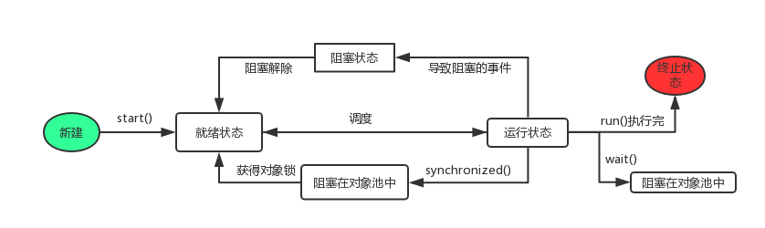

# java 多线程

---
## 多线程的生命周期

---

新建，就绪，运行，阻塞，结束。

1 创建状态：new

2 可运行状态Runnable: start()-->调用run()，这状态并没有真正运行。

3 不可运行状态： sleep(),wait(),线程输入、输出阻塞

返回可运行状态条件：sleep（），睡眠时间结束；notify(),notifyAll()通知等待线程条件
改变；输入，输出问题，等待其完成。

5 运行状态：真正执行。

6 结束： 线程运行完毕。

sleep,join 进入阻塞

wait 等待阻塞

synchronized 进入锁定的阻塞（对象池中）

详细解释：

## 并行、并发、临界区、阻塞、非阻塞

---
并行：表示两个线程同时运行。

并发：表示线程一会做这个事情，一会做另一个事情。存在调度问题。

线程安全： 在并发情况下，代码经过多线程的使用，多线程的调度不影响任何结果。

## 死锁

---
死锁的概率：

活锁：

饥饿：一个线程一直无法获取所需的资源，导致一直无法执行。

悲观锁：每次操作都会加锁，会造成线程阻塞。
乐观锁：每次操作不加锁而是假设没有冲突而去完成某项操作，如果因为冲突失败就重试，直到成功为止，不会造成线程阻塞。
## 线程调度策略

分时调度模型

抢占式调度模型

---

## 单线程的创建

---
1. 继承Thread类
2. 实现Runnable接口

多线程：从微观来讲，某一时刻只有一个线程在工作，多线程的目的是让cpu忙起来。

## 线程池

---
为什么使用线程池，优点：

1. 减少创建线程所需时间。
2. 可以对线程进行统一的分配，调优和监控。
3. 提供队列，存放缓冲的等待执行的任务。

线程池的实现：

[深入浅出线程池](https://zhuanlan.zhihu.com/p/33264000)

1. 原生线程池 ThreadPoolExecutor
2. FixedThreadPool，CachedThreadPool,ScheduledThreadPool

## volatile

作用：

加入volatile 关键字的变量在进行汇编时会多出一个lock前缀指令，相当于内存屏障，保证内存操作的顺序。
当神明为volatile的变量进行写操作时，那么这个变量需要将数据写到主存中。

由于处理器会实现缓存一致性协议，所以写到主存后会导致其他处理器的缓存无效，也就是线程工作内存无效，需要从主存中重新刷新数据。

## synchronized()

多线程环境下共享同一个数据，对共享数据涉及到修改操作。

synchronized使用

## 线程间协作：wait/notify/notifyAll

##CAS Compare And Swap 比较替换
实现并发应用到的一种技术。操作保护三个操作数：内存位置（V）预期原值（A），新值（B）

## java concurrent包
问题：

操作int的多线程场景下怎么控制线程安全。

原子类 AtomicInteger，AtomicLog

CountDownLatch：利用它可以实现类似计数器的功能。

业务场景：

可以利用AtomicInteger 去计算业务多线程成功数量并记录日志。

##多线程问题

---------
问题1： 多线程的返回结果顺序怎么搞？

## 高并发 多线程

高并发的指标：
1. 响应时间 Response Time，http 200ms;
2. 吞吐量Throughput：单位时间内处理请求数量。
3. 每秒查询率QPS Query per Second
4. 并发用户数

多线程：对应cpu

高并发: 对应是请求访问,可以用单线程，也可以用多线程，处理访问请求。

多线程和高并发问题解决：

1. 服务器网络宽带不够
2. 可能web线程连接数不够
3. 可能数据库连接查询上不去
4. 数据产生脏读

解决：

1. 增加网络带宽，DNS域名解析分发多台服务器
2. 负载均衡，前置代理服务器nginx、apache等
3. 数据库查询优化，读写分离，分表
4. 尽量使用缓存，用户缓存，信息缓存。
5. 避免产生脏读可以设置事务的隔离级别；java代码或数据库加锁。

分布式的理解：

对应用程序进行分层，各层之间相互独立，通过服务或接口来进行调用。业务数据量多的情况下，可以构建分布式的数据库系统。分布式技术实现数据库同步，以达到数据共享的目的。

将庞大系统按服务功能或表示层，中间层，数据层，细化，划分为多个系统，然后系统之间通过消息队列中间件如activemq进行消息通讯。在搭配使用分布式数据库缓存。

高并发技术方案：

1. 分布式缓存：Redis，memcached,cdn解决图片访问。
2. 消息队列中间件：activeMQ ,解决大量消息的异步能力。
3. 应用拆分：一个工程被拆分为多个工程部署，利用dubbo解决多工程之间的通信。
4. 数据库垂直拆分和水平拆分（分库分表）
5. 数据库读写分离，解决大数据的查询问题。
6. 利用nosql，列如MongoDB配合mysql组合使用。
7. 大数据访问情况下的服务降级以及限流机制等。

