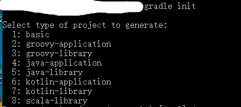

# Learn Gradle

  Notes
  参考：[官方网站https://gradle.org/](https://gradle.org/)

## Abstract(Description)

## 理解
  Gradle构建脚本文件处理：1 项目project；2 任务task.
  
  DSL 域特定语言
  Groovy

## Gradle 常用命令

[命令行详解](https://www.jianshu.com/p/bd83b57ea0a2)

```
gradle -q taskname # 执行任务
gradle -q task1 task2 #执行多个任务
gradle -x task1 # 排除任务task1

gradle -q -b /sub/newbuild.gradle task # 选择指定构建文件
gradle -q projects
gradle -q task --all 
gradle –q dependencies
gradle –q properties
```

## Gradle 任务
1 定义任务
```
task hello{
    description 'task description'
    doLast{
        println 'hello world'
    }

    doFirst{
        println 'pre execute cause'
    }
}
```
2 任务实现继承方式,依赖
```
# 方式一
task intro(dependsOn:hello){
    println 'intro'
}

# 方式二
intro.dependsOn hello

# 方式san
intro.dependsOn{
    tasks.findAll{
        task -> task.name.startsWith('hello')
    }
}
```

3 定位任务
```
task hello
println hello.name
println project.hello.name
```
4 跳过任务
```
task complie{
    print 'complie task'
}

task.doFirst{
    if(true){
        throw new StopExecutionException()
    }
}

```

## Gradle 依赖管理

依赖关系配置

1. 编译 complie
2. 测试编译 testComplie
3. 运行时 runtime
4. 测试运行时 testRuntime

外部依赖
```
# 表示方法 group组织，name, version版本
dependencies {
   compile group: 'org.hibernate', name: 'hibernate-core', version: '3.6.7.Final'
}
```

Gradle 指定仓库
```
repositories {
    mavenLocal()
    maven { url "http://maven.aliyun.com/nexus/content/groups/public/"}
    mavenCentral()
    jcenter()
    maven { url "https://repo.spring.io/snapshot" }
    maven { url "https://repo.spring.io/milestone" }
    maven { url 'http://oss.jfrog.org/artifactory/oss-snapshot-local/' }  //转换pdf使用
```
说明：

  指定本地仓库
mavenLocal() 时Gradle默认会按以下顺序去查找本地的maven仓库：USER_HOME/.m2/settings.xml >> M2_HOME/conf/settings.xml >> USER_HOME/.m2/repository。注意，环境变量要加入M2_HOME， 我们配环境时很多时候都是使用MAVEN_HOME或者直接在path中输入bin路径了，导致mavenLocal无法生效。

mavenLocal()：指定使用maven本地仓库，而本地仓库在配置maven时setting文件指定的仓库位置。如<localRepository>D:/repository</localRepository>，同时将setting文件拷贝到C:\Users\Administrator\.m2目录下，一般该目录下是没有setting文件的，gradle查找jar包顺序如下：gradle默认会按以下顺序去查找本地的仓库：USER_HOME/.m2/settings.xml >> M2_HOME/conf/settings.xml >> USER_HOME/.m2/repository。 

maven { url "http://maven.aliyun.com/nexus/content/groups/public/"}：指定阿里云镜像加速地址 

mavenCentral()：这是Maven的中央仓库，无需配置，直接声明就可以使用 

jcenter():JCenter中央仓库，实际也是是用的maven搭建的，但相比Maven仓库更友好，通过CDN分发，并且支持https访问。 

后面的maven { url 地址}，指定maven仓库，一般用私有仓库地址或其它的第三方库 
gradle按配置顺序寻找jar文件。如果本地存在就不会再去下载。不存在的再去maven仓库下载，这里注意下载下来的jar文件不在maven仓库里，而是在gradle的主工作目录下，如上面的D:\.gradle目录 


## Gradle 创建默认项目



参考：

1. [Gradle实战](http://www.souvc.com/?p=2573)
2. [IDEA gradle 配置使用](https://blog.csdn.net/achenyuan/article/details/80682288)

## gradle.build 构建脚本
```
buildScript {
    repositories {
         mavenCentral()
    }
}

repositories {
     mavenCentral()
}

```

## Gradle 构建文件build.gradle详解
```
apply plugin: 'java'

repositories {
   jcenter()
}

dependencies {
   compile 'org.slf4j:slf4j-api:1.7.12'
   testCompile 'junit:junit:4.12'
}

# 指定可执行文件main方法
jar {
   manifest {
      attributes 'Main-Class': 'com.yiibai.main.Application'
   }
}
test{
    // enable TestNG support (default is JUnit)
   useTestNG()

   // set a system property for the test JVM(s)
   systemProperty 'some.prop', 'value'

   // explicitly include or exclude tests
   include 'org/foo/**'
   exclude 'org/boo/**'

   // show standard out and standard error of the test JVM(s) on the console
   testLogging.showStandardStreams = true

   // set heap size for the test JVM(s)
   minHeapSize = "64m"
   maxHeapSize = "512m"

   // set JVM arguments for the test JVM(s)
   jvmArgs '-XX:MaxPermSize=256m'

   // listen to events in the test execution lifecycle
   beforeTest { 
      descriptor → logger.lifecycle("Running test: " + descriptor)
   }

   // listen to standard out and standard error of the test JVM(s)
   onOutput { 
      descriptor, event → logger.lifecycle
         ("Test: " + descriptor + " produced standard out/err: " 
         + event.message )
   }


}

```

说明：
 ```
 #执行测试任务
 gradle <someTestTask> --debug-jvm
 ```

## Gradle 多项目构建
```
allprojects {
   group = 'com.example.gradle'
   version = '0.1.0'
}

subprojects {
   apply plugin: 'java'
   apply plugin: 'eclipse'
}
```
```
// build.gradle

subprojects{
    apply plugin: 'java'
}

project(':user'){
    dependencies {
        # 指定依赖项目utils
        compile project(':utils')
    }   
}
```
## 编译项目user
```
gradle user:build -a(是否编译依赖的项目)
```

## Gradle部署

## 将项目从Maven转换为Gradle
```
gradle init --type pom
```


