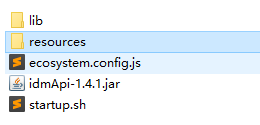
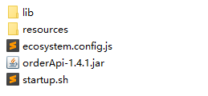

# 订单系统部署文档(v1.8.0)

## 仓库地址

1. idm身份管理服务，order服务仓库地址 ：
   

   [http://git.beiruosi.wang:3000/j100057/brs-service-api.git ](http://git.beiruosi.wang:3000/j100057/brs-service-api.git)

2. idm代理所在仓库地址：
   
   [ http://git.beiruosi.wang:3000/j100057/brs-idm-proxy.git  ]( http://git.beiruosi.wang:3000/j100057/brs-idm-proxy.git )

3. order-staff代理所在仓库地址:
  
    [ http://git.beiruosi.wang:3000/j100057/brs-order-proxy-staff.git ]( http://git.beiruosi.wang:3000/j100057/brs-order-proxy-staff.git )

4. order-client代理所在仓库地址：
   
    [http://git.beiruosi.wang:3000/j100057/brs-order-proxy-client.git ]( http://git.beiruosi.wang:3000/j100057/brs-order-proxy-client.git )

## 安装环境

1. install java, openjdk version "1.8.0_212"
2. install redis,最新版本
3. install node , v10.15.3
4. install npm , 6.4.1


## 1 idm 服务部署

---
### 1.1 idm 文件说明



1. lib 保存执行文件所需要的所有jar包
2. resources 文件夹里保存执行文件所需要的配置文件。
3. ecosystem.conf.js 为pm2启动执行文件的配置。
4. startup.sh 为linux系统执行jar文件脚本。

### 1.2 生产环境部署
1 需要修改配置文件 application.yml（application.yml 在reources目录下。）

下面为生产环境下需要修改的地方：

1. 服务ip地址；
2. ldap的url地址；
3. mysql数据库地址；
4. redis地址要配置为生产环境地址；
5. idmAppUrl 值与当前服务器 ip地址相同；ssoAppUrl 值也与当前服务器ip地址相同。
注：ssoAPPUrl是单点登录服务，idmAppUrl是权限管理服务器，因为idm服务包括上面的服务，所有它们的地址都相同。

```
# app service
app-service:
  idmAppUrl: http://localhost:8085
  ssoAppUrl: http://localhost:8085

```

2 配置管理员账号

说明 管理员账号采用员工号，将100057 改为指定的管理员账号

```
# idm admin
idm-user:
  admin: 100057
```

3  java命令启动idm服务
```
java -jar idmApi-[最新版本].jar --Dspring.config.location=resource/application.yml

```

## 2 idm 代理 部署

1 生产环境下需要修改配置文件 prod.js

下面为生产环境下需要修改的地方：

1. ip地址；
2. 端口号；
3. 后台管理服务接口地址，要和上面配置的地址一致；
  
```
module.exports ={
    env:'production',
    ip: 'localhost',
    port: 8080,
    permissionProxy: 'http://localhost:8085', //后台管理服务
    web: '../web/[最新版本]',//web路径
}

```

2 启动 idm 代理

```
   # 启动方式一
    npm run prod
  # 启动方式二
  pm2 start --env prod
```

## 3 idm数据库迁移
---
数据库所在地址：172.18.19.2:4000,数据名称：brs_idm

说明：

1. act_id_group  为角色表，里面内容固定，不要删除。内容也要迁移
2. act_id_priv 为权限表，里面内容固定；不要删除。内容也要迁移
3. 其他表都为空，没有内容。


## 4 管理员账号设置
---

1. 在idm->applicaiton.yml中指定管理员账号（员工工号）

```
# idm admin
idm-user:
  admin: 100057
```
2. 在brs_idm数据库表act_id_user中添加管理员账号，同上面的配置即可。

```
## ID_ 为存放工号
insert into act_id_user(ID_,LAST_,FIRST_)value("100057","tiny","lin");
```


## 5  订单服务部署


### 1 order service 文件结构



### 2 order service 生产环境部署

1 需要修改配置文件 application.yml，application-prod.yml（在reources目录下。）

application.yml 修改active: prod

```
spring:
  profiles:
    active: prod
```

application-prod.yml需要修改的地方：

1. 服务ip地址；
2. myql 订单数据库地址；
3. upload-dir 上传文件存放路径，服务端绝对路径。
4. order-template-dir 订单模版目录，服务端绝对路径。
说明：签单表.zip访问共享文件夹方式可以获取：\\172.18.19.3
  
```
# file service absolute path
file-service:
  upload-dir: /home/brsdev/project/upload
  order-template-dir: /home/brsdev/projectorderTemplate
```
1. idmAppUrl 值与当前服务器 ip地址相同；ssoAppUrl 值也与当前服务器ip地址相同。
注：ssoAPPUrl是单点登录服务，idmAppUrl是权限管理服务器，因为idm服务包括上面的服务，所有它们的地址都相同。

```
# app service
app-service:
  idmAppUrl: http://localhost:8085
  ssoAppUrl: http://localhost:8085

```


### 3 java命令启动order服务
```
java -jar orderApi-[最新版本].jar --Dspring.config.location=resource/application.yml

```


## 6 order client，staff 代理 部署

1 生产环境下需要修改配置文件 prod.js

---
1. ip地址；
2. 端口号；
3. idm服务接口地址，要和上面配置的地址一致；
4. order服务接口地址，要和上面配置的一致；

```
module.exports ={
    env:'production',
    ip: 'localhost',
    port: 8031,
    permissionProxy: 'http://localhost:8085', //权限服务器
    orderServerProxy:'http://localhost:8088',//订单服务器
    web: '../web/[最新版本]'//网页路径
}
```

2  启动 order 代理
```
   # 启动方式一
    npm run prod
  # 启动方式二
  pm2 start --env prod
```

## 7 订单系统数据库迁移

数据库所在地址：172.18.19.2:4000,数据库名称：brs_order

说明：
brs_order 数据库全为空表，只需要迁移表结构，不需要迁移内容。


